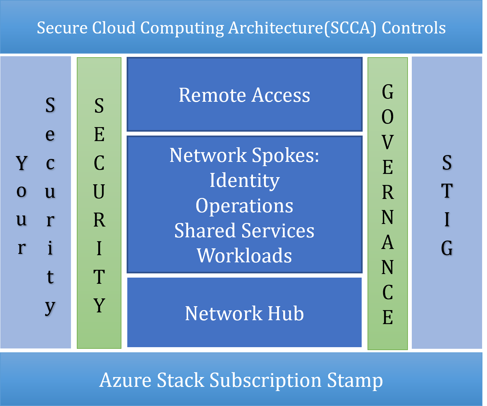
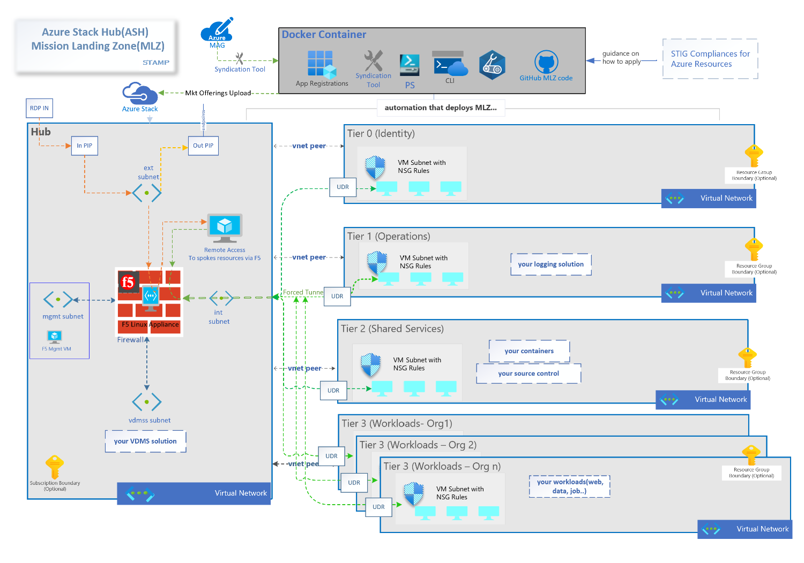

# Mission LZ - Edge

Mission Landing Zone Edge is a highly opinionated template which IT oversight organizations can used to deploy compliant enclaves on Azure Stack Hub stamps. It addresses a narrowly scoped, specific need for an SCCA compliant hub and spoke infrastructure.

Mission LZ Edge is:

- Designed for US Gov mission customers​
- Implements [SCCA](https://docs.microsoft.com/en-us/azure/azure-government/compliance/secure-azure-computing-architecture) requirements following Microsoft's [SACA](https://aka.ms/saca) implementation guidance
- Deployable on Azure Stack Hubs configured to connected or disconnected at all classification levels
- A narrow scope for a specific common need​
- A simple solution with low configuration​
- Written in Bicep

Mission Landing Zone is the right solution when:

- A simple, secure, and repeatable hub and spoke infrastructure is needed
- Various teams need separate, secure cloud environments administered by a central IT team
- There is a need to implement SCCA
- Hosting any workload requiring a secure environment, for example: data warehousing, AI/ML, or IaaS hosted workloads

Design goals include:

- A simple, minimal set of code that is easy to configure
- Good defaults that allow experimentation and testing in a single subscription
- Deployment via command line

Our intent is to enable IT Admins to use this software to:

- Test and evaluate the landing zone using a single Azure subscription
- Deploy multiple customer workloads in production

## Scope

Mission LZ Edge has the following scope:

- Hub and spoke networking intended to comply with SCCA controls
- Predefined spokes for identity, operations, shared services, and workloads
- Ability to create multiple, isolated workloads
- Remote access
- Compatibility with SCCA compliance (and other compliance frameworks)
- Security using standard Azure tools with sensible defaults

<!-- markdownlint-disable MD033 -->
<!-- allow html for images so that they can be sized -->

<!-- markdownlint-enable MD033 -->

## Networking

Networking is set up in a hub and spoke design, separated by tiers: T0 (Identity and Authorization), T1 (Infrastructure Operations), T2 (DevSecOps and Shared Services), and multiple T3s (Workloads). Access control can be configured to allow separation of duties between all tiers.

<!-- markdownlint-disable MD033 -->
<!-- allow html for images so that they can be sized -->

## Subscriptions

Most customers will deploy each tier to a separate Azure subscription, but multiple subscriptions are not required. A single subscription deployment is good for a testing and evaluation, or possibly a small IT Admin team.

## Firewall

All network traffic is directed through the firewall residing in the Network Hub resource group. The firewall is configured as the default route for all the T0 (Identity and Authorization) through T3 (workload/team environments) resource groups.  

The default firewall configured for MLZ edge is a single F5 BIG-IP VE. Review the [Configuring F5 README](docs/Configuring_F5.md) for detailed instructions on how to configure the F5.

## Getting Started

1. Prior to deploying the Mission Landing Zone Edge on a new install of Azure Stack Hub (ASH), the ASH marketplace must be populated with the necessary items to support the deployment. Review the [Deployment Container README](docs/Deployment_container_setup.md) to set up Azure stack Hub with required artifacts.

2. Review the [Deployment Guide for Mission LZ Edge](docs/MLZ_Deployment.md).

## Product Roadmap

See the [Projects](https://github.com/Azure/missionlz-edge/projects) page for the release timeline and feature areas.

Here's a summary of what Mission Landing Zone Edge deploys of as of February 2022:

<!-- markdownlint-disable MD033 -->
<!-- allow html for images so that they can be sized -->

<!-- markdownlint-enable MD033 -->

## Contributing

This project welcomes contributions and suggestions. See our [Contributing Guide](CONTRIBUTING.md) for details.

## Trademarks

This project may contain trademarks or logos for projects, products, or services. Authorized use of Microsoft
trademarks or logos is subject to and must follow
[Microsoft's Trademark & Brand Guidelines](https://www.microsoft.com/en-us/legal/intellectualproperty/trademarks/usage/general).
Use of Microsoft trademarks or logos in modified versions of this project must not cause confusion or imply Microsoft sponsorship.
Any use of third-party trademarks or logos are subject to those third-party's policies.
